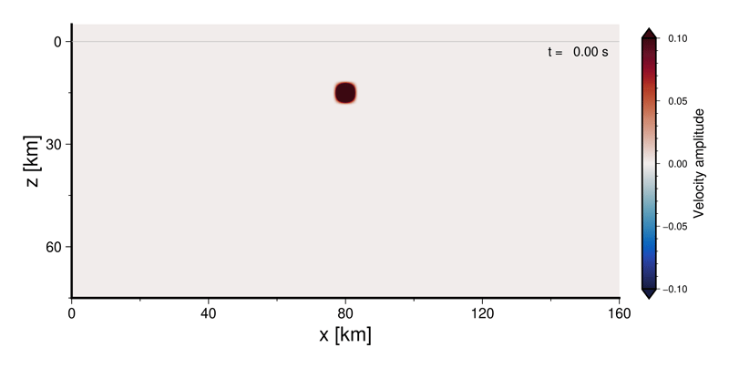

## 開催予告

### 日時

2025年10月30日（木）13:00〜16:00 オンライン（Zoom）

### 内容

波動方程式の半直感的な紹介からはじめ，差分法を用いた地震波の数値シミュレーションを，基本概念から座学＋クラウド上のプログラミング環境を用いたハンズオン形式を用いて学びます．以下の動画のような簡単な数値シミュレーションの原理を理解し，また実行できるようになることが目標です．

### 対象

地震波動伝播数値シミュレーションに興味があるが，その方法をほとんどあるいはまったく学習したことのない学部生や大学院生の方．

### 定員

最大 XX 名（先着順）

### 前提知識・必要となる準備

- 大学初年度で習う程度の微分積分（Taylor展開や偏微分を含む）の知識を必要とします．
- プログラミング（特にPython）の経験があればなおよいですが，必須ではありません（講習会のなかで説明します）．
- 受講にあたり，**Googleアカウント** を持っていること必要です．受講当日までにご準備ください．

## 参加資格

とくになし．

## 参加申し込み

準備中．2025年8月ごろ申し込み受付開始予定です．
