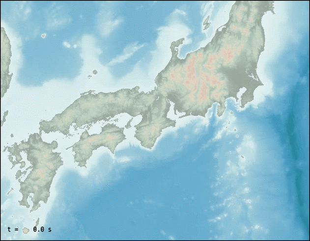

## 開催予告

### 日時

2025年11月6日（木）13:00〜16:00 オンライン（Zoom）

### 内容

地震波動伝播数値シミュレーション手法の概略の講義ののち，オープンソースソフトウェアOpenSWPCとコンピュータクラスタ（スーパーコンピュータ）を用いた実践的な数値シミュレーションについて，実習形式で学びます．この講習会では，以下のような現実的な3次元的に不均質な日本列島構造下における地震波動伝播数値シミュレーションを実行できるようになるととおｍに，その適切なパラメタ設定法を理解し，今後の研究活動に活用できるようになることを目指します．

### 対象

地震波動伝播数値シミュレーションやそれを用いた研究に興味がある学生や研究者の方．

### 定員

（検討中）

### 前提知識・必要となる準備

- 地震学（とくに地震波動）に対する学部講義レベルの知識とそれを理解する程度の初歩的な物理数学の知識を前提とします．
- FortranやPythonなどの何らかのプログラミング言語の経験があることが望ましいです．
  - 講義ではFortranの文法を用いますが，必要に応じて補足説明がなされます．
- 実習においては，Linuxのごく基本的な操作ができることが必要です．
  - 具体的には『リモートホストにSSHでログインして，そのホスト上のファイルを編集する』ことができれば十分です．
- 実習にあたり，東京大学地震研究所が提供する[EIC計算機システム](https://eic-support.eri.u-tokyo.ac.jp)のアカウントが必要です．詳しくは申し込みいただいた方に別途ご案内します．

### 参加資格

実習で用いるEIC計算機システムの利用資格が『国立大学法人、公、私立大学および国、公立研究機関の教員・研究者又はこれに準じるもので、利用目的が地震・火山・防災の関連分野の研究遂行にかかわるもの』とされているため，本講習会の参加資格もそれに準じます．
（研究者とは大学院生を含みます．学部生については調整中です）

## 参加申し込み

準備中．2025年8月ごろ申し込み受付開始予定です．
