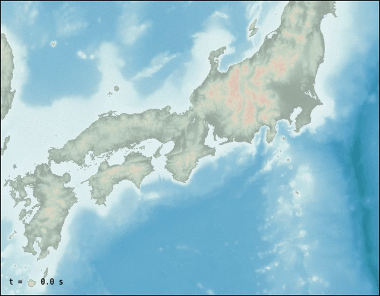

## 2025年度講習会

:::: {.panel-tabset}

## 初級編

### 日時

2025年10月30日（木）13:00〜16:00 オンライン（Zoom）

### 内容

地震学における波動方程式の半直感的な紹介からはじめ，差分法を用いた地震波の数値シミュレーションを，基本概念から座学＋クラウド上のプログラミング環境を用いたハンズオン形式を用いて学びます．以下の動画のような簡単な地震波伝播数値シミュレーションの原理を理解し，また実行できるようになることが目標です．

### おもな対象

地震波動伝播数値シミュレーションに興味はあるが，その方法をほとんどあるいはまったく学習したことのない学部生や大学院生の方．

### 定員

30名

### 前提知識・必要となる準備

- 大学理系初年度で習う程度の微分積分（Taylor展開や偏微分を含む）の知識を必要とします．
- プログラミング（特にPython）の経験があればなおよいですが，必須ではありません（講習会のなかでくわしく説明します）．
- 講習会中に実施するハンズオン（実習）に参加するためには **Googleアカウント** が必要です．※アカウント名を開催者に伝える必要はありません．

## 中級編

### 日時

2025年11月13日（木）13:00〜16:00 オンライン（Zoom）

### 内容

差分法による地震波動伝播数値シミュレーション手法の概略を紹介したのち，オープンソースソフトウェアOpenSWPCとコンピュータクラスタ（スーパーコンピュータ）を用いた実践的な数値シミュレーションについて，実演および実習を通じて学びます．この講習会では，以下のような現実的な3次元的に不均質な日本列島構造下における地震波動伝播数値シミュレーションを実行できるようになるとともに，そのパラメタ設定法の基礎を理解し，今後の研究活動に活用できるようになることを目指します．

### おもな対象

地震波動伝播数値シミュレーションやそれを用いた研究に興味がある学生や研究者の方．

### 定員

30名

### 前提知識・必要となる準備

- 地震学（とくに地震波）に関する学部レベルの知識と，それを理解するのに必要な程度の初歩的な物理数学の知識を前提とします．
- FortranやPythonなどの，何らかのプログラミング言語の利用経験があることが望ましいです．
  - 講習会では主にFortranを用いますが，不慣れな方向けに文法の補足説明がなされます．
- 実習に参加するためには，Linuxのごく基本的な操作ができることが必要です．
  - 具体的には『リモートホストにSSHでログインして，そのホスト上のテキストファイルを編集する』ことができれば十分です．
- 実習および実演は，東京大学地震研究所が提供する[EIC計算機システム](https://eic-support.eri.u-tokyo.ac.jp)を用いて行います．実習に参加するにはアカウントが必要です．アカウント申し込みのための解説は[こちら](/HPC/EIC-2025/EIC2025-02-new.md)にあります．※実習に参加せず聴講だけでも構いません．

::: {.callout-note}
実習で用いるEIC計算機システムの利用資格は『国立大学法人、公、私立大学および国、公立研究機関の教員・研究者又はこれに準じるもので、利用目的が地震・火山・防災の関連分野の研究遂行にかかわるもの』とされています．
（ここでの「研究者」には大学院生を含みます．）
:::

::::

### 参加申し込み

[Google Form](https://forms.gle/mnWVqDF3z1knmsqbA) で申し込みを受け付けています．
