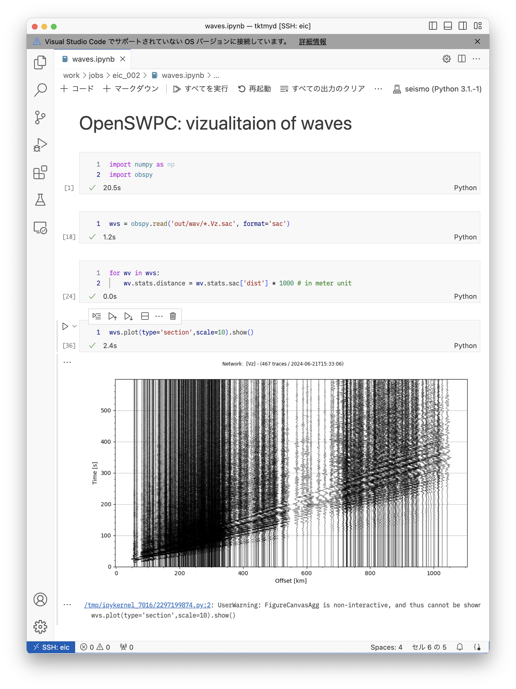

## OpenSWPCのダウンロードとコンパイル

OpenSWPCは https://github.com/OpenSWPC/OpenSWPC で公開されています．
このURLから見られる個別のソースコードは，開発途中で登録されている場合があり，したがって未完成だったりバグを含むこともあります．
それに対して，一定のアップデートのまとまりごとに **release** としてバージョン番号を付与されたものがzip形式で圧縮されて [https://github.com/OpenSWPC/OpenSWPC/releases](https://github.com/OpenSWPC/OpenSWPC/releases) から公開されています．
このreleaseはZenodoによりバージョン個別のDOIが付与（たとえば [こちら](https://doi.org/10.5281/zenodo.13756043)）されており，論文等での引用にも便利です．

ここでは，公開されている最新版Version 25.01 をダウンロード・コンパイルしてみます．

EICで以下の通り実行します．これはホームディレクトリで行っても `/work` で行ってもどちらでもかまいません．

```bash
$ curl -OL https://github.com/OpenSWPC/OpenSWPC/archive/refs/tags/25.01.zip
$ unzip 25.01.zip # ダウンロードしたファイルを解凍
```

::: {.callout-note}
コマンド `curl` はWebからデータをダウンロードしたり，あるいはWebページの入力フォームに値を送信したり，ブラウザで作業することの代わりができるものです．

ここでは，進捗状況を表示するオプション `-O` と，もしURLが他の場所にリダイレクト（ショートカットによるリンクのようなもの）されていた場合も追跡するオプション `-L` を用いて，公開されているzipファイルを直接ダウンロードしています．
:::

すると，ディレクトリ `OpenSWPC-25.01` が出来上がるはずです．

::: {.callout-note}

もし，`OpenSWPC-5.3.1` 以前のバージョンをお使いの場合には，以下のようにします．この囲み記事の操作は，バージョン24.09以降では不要となりました．

適当なエディタでOpenSWPC-5.3.1を開き，`src/shared/makefile.arch` ファイルを開きます．66行目から以下のように書かれている箇所があります．

```makefile
##
## EIC @ ERI,U-TOKYO (2020 System)
##
ifeq ($(arch),eic)
  FC      = ifort
  FFLAGS  = -xCORE-AVX2 -O3 -lmpi -I../include -D_INFO -qopenmp
  NCFLAG  = -D_NETCDF
  NCLIB   = -L$(HOME)/local/lib
  NCINC   = -I$(HOME)/local/include
  NETCDF  = -lnetcdff -lnetcdf -lhdf5_hl -lhdf5 -lz

  ifeq ($(publish),true)
    FFLAGS = -xCORE-AVX2 -O3 -lmpi -I../include -D_INFO -static-intel -qopenmp -mcmodel=small
  endif

  ifeq ($(debug),true)
    FFLAGS  = -lmpi -qopenmp -CB -traceback -static-intel -I../include -D_INFO -D_DEBUG -mcmodel=small
  endif

endif
```
これを，以下の通り書き換えてください．
```makefile
ifeq ($(arch),eic)
  FC      = module purge; module load intel mpt lib/NetCDF lib/HDF5; ifort
  FFLAGS  = -xCORE-AVX512 -O3 -I../include -D_INFO -qopenmp -lmpi
  NCFLAG  = -D_NETCDF
  NCLIB   = 
  NCINC   = 
  NETCDF  = -lnetcdff -lnetcdf -lhdf5_hl -lhdf5 -lz
endif
```

同様に，`src/shared/makefile-tools.arch` ファイルも開きます．

```makefile
ifeq ($(arch),eic)
  FC      = ifort
  FFLAGS  = -xAVX -O3 -I../include -D_INFO
  NCFLAG  = -D_NETCDF
  NCLIB   = -L$(HOME)/local/lib
  NCINC   = -I$(HOME)/local/include
  NETCDF  =  -lnetcdff -lnetcdf -lhdf5_hl -lhdf5 -lz

  ifeq ($(publish),true)
    FFLAGS = -xHOST -O2 -lmpi -I../include -D_INFO -static-intel -mcmodel=small
  endif

endif
```

上記の部分を，以下のように書き換えます．

```makefile
ifeq ($(arch),eic)
  FC      = module purge; module load intel mpt lib/NetCDF lib/HDF5; ifort
  FFLAGS  = -xCORE-AVX512 -O3 -I../include -D_INFO 
  NCFLAG  = -D_NETCDF
  NCLIB   = 
  NCINC   = 
  NETCDF  = -lnetcdff -lnetcdf -lhdf5_hl -lhdf5 -lz
endif
```

:::

コンパイルを実行します．ターミナルから，以下のように実行します．

```bash
$ cd OpenSWPC-25.01 # ディレクトリを移動
$ cd src            # ソースコードのある場所に移動
$ make arch=eic     # EIC モードでコンパイル
```

すると，しばらくコンパイルのためのメッセージが流れます．終わったら，実行ファイルができていることを確認しましょう．

```bash
$ cd .. # OpenSWPC-25.01/src から OpenSWPC-25.01 の直下に移動
$ ls bin/
diff_snp.x    fs2grd.x        gen_rmed3d.x   ll2xy.x        mapregion.x   
read_snp.x    swpc_psv.x      timvis.gmt     wvconv.x       fdmcond.x   
gen_rmed2d.x  grdsnp.x        mapregion.gmt  qmodel_tau.x   swpc_3d.x   
swpc_sh.x     timvis_abs.gmt  xy2ll.x
```

`bin` ディレクトリの下にたくさんの `*.x` ファイルができています． OpenSWPCでは `x` 拡張子は実行ファイルです．

`swpc_*.x` は2次元SH問題・2次元P-SV問題・3次元問題のシミュレーションソフトウェア本体です．その他の `.x` ファイルは，結果データの可視化や処理等に使うためのユーティリティ群です．これらがすべてコンパイルされました．

## おためし実行

それでは，コンパイルした結果を実行してみます．以下では，自分のホームディレクトリの直下に `OpenSWPC-25.01` があるとみなしますが，そうでなかったら適宜読み替えてください．

```bash
$ cd 
$ cd work/jobs  # work以下で作業します．work は /work/${USER} へのシンボリックリンクです．
$ mkdir eic_002 # ジョブ実行のためのディレクトリを作成．名前や場所はお好みで
$ cd eic_002    # 作成したディレクトリに移動
$ cp -rf ~/OpenSWPC-25.01/example .   # OpenSWPCのexampleディレクトリをまるごとコピー
$ cp -rf ~/OpenSWPC-25.01/bin .       # binディレクトリを中身ごとコピー
```

ここでは， `example` ディレクトリにあるサンプルパラメタファイル `input_NJapan.inf` を用いた北日本における3次元地震波シミュレーションをしてみましょう．エディタ（VSCode）で `example/input_NJapan.inf` ファイルを開いて，いくつかのパラメタを修正します．

```Fortran
nproc_x          = 6                !! parallelization in x-dir
nproc_y          = 6                !! parallelization in y-dir
```

上記の部分を，以下のように修正してください．

```Fortran
nproc_x          = 4                !! parallelization in x-dir
nproc_y          = 2                !! parallelization in y-dir
```

::: {.callout-tip}
これは利用するCPUの数です．日本列島周辺の領域を，X軸方向に4つx Y軸方向には2つの8個に分割して並列計算します．
:::

ジョブスクリプト `job.sh` は以下のように作ります．最初の例よりもたくさんのCPUを使うクラスでの実行のため，こまごまと設定が変わっています．

```bash
#!/bin/bash
#PBS -q E 
#PBS -l select=2:ncpus=80:mpiprocs=4:ompthreads=20:mem=755gb
#PBS -N OpenSWPC-example
## -------------------------------------- ##
source /etc/profile.d/modules.sh
module load intel mpt lib/NetCDF lib/HDF5 
cd $PBS_O_WORKDIR
## -------------------------------------- ##
# OpenSWPCの構造モデル等の置き場の設定
export DATASET=/work/tktmyd/dataset  
## -------------------------------------- ##
mpiexec omplace -bs ./bin/swpc_3d.x -i example/input_NJapan.inf
```

::: {.callout-important}
`mem=755gb` は最近その存在が判明したオプションで，これを付与しないと，メモリを最大限に使い切ることができないようです．755GB以下のメモリしか使わない場合でも，このオプションを指定して不利になることはありませんから，常に付けておくことをお勧めします．
:::

特に `DATASET` 環境変数の設定は重要です．
これにより，`input_NJapan.inf` の `${DATASET}` という記述が `/work/tktmyd/dataset` に展開されます．
このディレクトリには日本列島下の3次元不均質構造モデルJIVSMや，Hi-net観測点の一覧などのデータファイルが含まれています． 

::: {.callout-note}
`/work/tktmyd/dataset` は前田拓人のワーク領域ですが，EICユーザーならどなたでもファイルが見られる（プログラムから読み込める）設定になっていますので，そのままお使いください．OpenSWPC-25.01 直下にも `dataset` ディレクトリがありますが，その中には構造モデルの**生成スクリプト**が含まれているのみで，実際の構造モデルデータはありません．もちろん，その生成スクリプトで自分専用の構造モデルを作成してもよいでしょう．
:::

ジョブの投入は，以下のコマンドで行います．
```bash
$ qsub job.sh
```
標準エラー出力の最初の数十行は，以下のような出力が延々続きますが，これはエラーではありません．正常です．

```txt
[info{0}] m_output.F90(649): station N.HRDH is out of the region
[info{0}] m_output.F90(649): station N.SBNH is out of the region
[info{0}] m_output.F90(649): station N.KKIH is out of the region
```

全国のHi-net全観測点をデータ出力地点として設定しているのにもかかわらず，数値シミュレーションは北日本で実行しているため，西南日本の観測点がモデル中に入らず，警告文が表示されているに過ぎません．

上記の例のような `[info{番号}]` という表示は，OpenSWPCの内部情報を表示しているもので，エラーではありません．
その他の表示としては， `[warning{番号}]` や `[assert{番号}]` があります．
warningは，プログラムは止まらないものの，何か問題があることを示しています．assertはいわゆるエラーで，プログラムが止まります．
どちらの場合も，その右側に警告やエラーの発生した箇所が書かれていますので，それを参考にしてください．


以下は実行が始まってしばらくしてからの `qstatus` の表示です．
```txt
96492   tktmyd       R     E   eich24,eich26   160   8/20   00:06:14    12:45:48    122.9  617.86
```
一番右の数字は，この計算ジョブが利用している総メモリ量（GB）です．600GB超もの大容量のメモリを使う数値シミュレーションが動いています．
このことは，以下の例のように，計算中逐次更新される標準エラー出力ファイルからも確認できます．
```bash
 ------------------------------------------------------------------------------
  SWPC_3D version 24.09
 ------------------------------------------------------------------------------
 
  Grid Size               :     3200 x   1600 x    500
  MPI Partitioning        :        4 x    2
  Total Memory Size       :         614.426  [GiB]
  Node Memory Size        :          76.803  [GiB]
  Stability  Condition c  :           0.817  (c<1)
  Wavelength Condition r  :           8.949  (r>5-10)
  Minimum velocity        :           1.491  [km/s]
  Maximum velocity        :           8.084  [km/s]
  Maximum frequency       :           0.333  [Hz]
 
 ------------------------------------------------------------------------------

  it=0000050, 2.044 s/loop, eta 013:35:51, ( 0.00E+00  0.00E+00  0.00E+00 )
  it=0000100, 2.062 s/loop, eta 013:41:26, ( 0.00E+00  0.00E+00  0.00E+00 )
  it=0000150, 2.068 s/loop, eta 013:41:57, ( 4.77E-31  4.78E-31  7.00E-29 )
  it=0000200, 2.070 s/loop, eta 013:41:12, ( 2.55E-18  2.73E-18  2.97E-16 )
 ```
ただし，後者のメモリ使用量表示は概算値で，微妙に実測と異なります．
表示されているとおり，計算には13時間以上かかります．気長に待ちましょう．

 
## 出力結果の可視化

出力結果は以下の2種類です．

- **波形** : `./out/wav/*.sac` 
- **スナップショット**: `./out/*.nc` 

### 波形ファイル

波形はSeismic Analysis Code `sac` というプログラムの形式で，ObsPyから `obspy.read(filename, format='sac')` とすることで読み込むことができます．

::: {.callout-note}
ObsPyでは読み込むファイルの自動判別もできるはずです．しかし，OpenSWPCの出力を読み込むには，`format` を明示的に指定しなければならないことが多いようです．
:::



上図の例では，Python上で上下動成分の速度波形記録（成分名 `Vz`）を読み込み，そこからレコードセクション画像を作成しています．ObsPyでレコードセクションをプロットするためには，波形の `.stats.distance` に震央距離をメートル単位で保持しておく必要があります．一方，SACファイルとしては，`dist` というヘッダ変数に震央距離がkm単位で書き込まれており，ObsPyで読み込むと `.stats.sac.['dist']` でアクセスできます．そこで，すべての波形についてのループで，後者を前者に（単位換算をしつつ）コピーしています．その後，`plot(type='section')` でレコードセクション画像を作成しました．

### スナップショットファイル

地表海底，X, Y, Zのそれぞれの断面を出力でき，その結果を `read_snp.x` により可視化できます．`read_snp.x` を利用するためには，まず利用する動的ライブラリのロードが必要です：

```bash
$ module load intel mpt lib/NetCDF lib/HDF5
```

もしもロードできない旨のエラーが出た場合には，

```bash
$ module purge
```

で現在読み込まれているライブラリをいったん切り離し，もう一度上記コマンドでロードしてください．

```bash
$ cd out
$ ../bin/read_snp.x -i swpc_N.ob.v.nc -bmp -mul 20 
```
とすると，`bmp` ディレクトリが作られ，その中に連番画像が作られます．
以下のアニメーショんはそれを `ffmpeg` によって動画化したものです．

{fig-align="center"}

動画の作成法はたとえば [PyGMT-HowTo](https://tktmyd.github.io/pygmt-howto-jp/animation.html) を参照してください．

::: {.callout-tip}
ここでは簡単に表示できるgifアニメーションを選択しました．ただし，gifアニメーションは動画とは違ってスライダで早送りしたり特定の時間を選ぶことはできません．また，画質が少々落ちます．Powerpoint等に取り込むならば，MP4形式のほうが（一般的には）おすすめです．
:::
