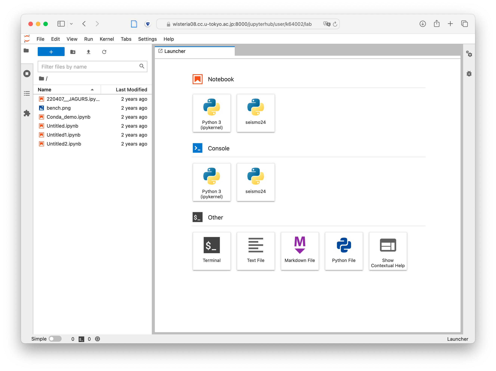
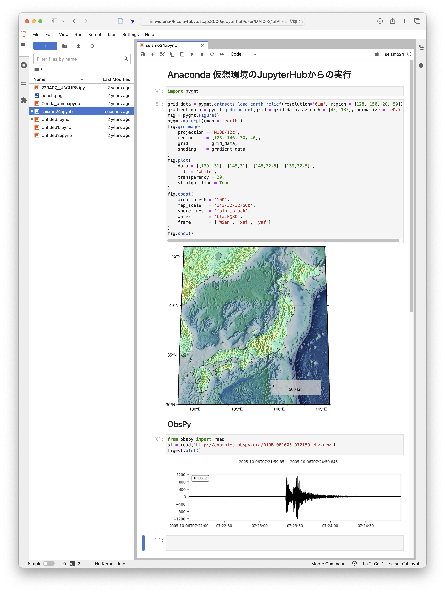

ここではPythonの仮想環境基盤としてMiniforgeを導入し，その中でNumPyやPyGMTを含めた仮想環境を作成します．

::: callout-important
ここで紹介する環境はいわゆる **Anaconda** として知られているPythonのパッケージ管理環境です． Anacondaは研究目的にも広く使われていたのですが，2024年のライセンス改訂によって，研究教育目的であっても無料で利用することが困難になりました．

ここでは，その代替としてMiniforgeを用います．MiniforgeはAnacondaのパッケージ管理コマンド `conda` と同等なものを提供する完全なオープンソースなプロジェクトです．
:::

## Miniforgeのインストール

まずは適当なディレクトリでMiniforgeを `curl` コマンドでダウンロードします．

``` bash
$ curl -L -O "https://github.com/conda-forge/miniforge/releases/latest/download/Miniforge3-$(uname)-$(uname -m).sh"
```

そのディレクトリでダウンロードしたスクリプトを `bash` で実行します．

``` bash
$ bash  ./Miniforge3-Linux-x86_64.sh
```

すると，対話的なインストーラが立ち上がります．

``` bash
Welcome to Miniforge3 24.3.0-0

In order to continue the installation process, please review the license
agreement.
Please, press ENTER to continue
>>> 
```

Enterで続けると，`END USER LICENSE AGREEMENT` が表示されます．スペースキーを何度か押して最下部までスクロールすると（読むと），

``` bash
Do you accept the license terms? [yes|no]
>>>  
```

と訊かれますから，`yes` と入力します．

続けてインストールする場所が訊かれます．デフォルトであれば自分のホームディレクトリの下に `miniforge3` が作られます． 特に問題なければそのままEnterします．

すると，しばらくインストール処理が走り，

``` bash
Installing base environment...
Downloading and Extracting Packages:
Preparing transaction: done
Executing transaction: done
installation finished.
Do you wish to update your shell profile to automatically initialize conda?
This will activate conda on startup and change the command prompt when activated.
If you'd prefer that conda's base environment not be activated on startup,
   run the following command when conda is activated:

conda config --set auto_activate_base false

You can undo this by running `conda init --reverse $SHELL`? [yes|no]
[no] >>> 
```

と訊かれます．これは設定ファイル `.bashrc` に自動的に `conda` を有効化するための設定を追加するかどうかを訊いています．`yes` が推奨です．

もし `no` を選んでしまった場合，手動で `.bashrc` ファイルに以下の内容を追記してください．

``` bash
# >>> conda initialize >>>
# !! Contents within this block are managed by 'conda init' !!
__conda_setup="$('/home/USERNAME/miniforge3/bin/conda' 'shell.bash' 'hook' 2> /dev/null)"
if [ $? -eq 0 ]; then
    eval "$__conda_setup"
else
    if [ -f "/home/USERNAME/miniforge3/etc/profile.d/conda.sh" ]; then
        . "/home/USERNAME/miniforge3/etc/profile.d/conda.sh"
    else
        export PATH="/home/USERNAME/miniforge3/bin:$PATH"
    fi
fi
unset __conda_setup

if [ -f "/home/USERNAME/miniforge3/etc/profile.d/mamba.sh" ]; then
    . "/home/USERNAME/miniforge3/etc/profile.d/mamba.sh"
fi
# <<< conda initialize <<<
```

ただし，`USERNAME` は自分のユーザー名に置き換えてください．

## Conda仮想環境の作成

Miniforgeが有効になっていると，Wisteria/BDECのプロンプトが

``` bash
(base) [USERNAME@wisteria05 ~]$ 
```

のように `(base)` とついたものに変更されているはずです． これはcondaの環境名で，初期状態 `base` が有効になっているという印です．

この状態では，システムに入っているPythonよりも，Miniforgeで自分がインストールしたPythonのほうが優先されます．たとえば，`python` コマンドの場所を調べてみると，

``` bash
$ which python
~/miniforge3/bin/python
```

と表示され，自分のホームディレクトリ以下，Miniforgeをインストールしたディレクトリの下にpython本体が入っていること，それがシステムのpythonよりも優先されていることがわかります．

Miniforgeでは，Python本体と関連ライブラリを丸ごとまとめた **仮想環境**をいくつも作り，必要に応じて切り替えて使うことができます．ここでは，地震波の解析に必要なライブラリを入れた仮想環境 `seismo24` を作成してみます．

``` bash
$ conda create --name seismo24 --channel conda-forge \
  python ipykernel pygmt gmt numpy scipy obspy netcdf4 \
  matplotlib cartopy ffmpeg
```

画面の幅の都合上2行に分かれていますが，これで1つのコマンドです．

::: callout-tip
Linuxのターミナルでは，行末にバックスラッシュ `\` を打つことで，1つのコマンドを複数行に分割できます．
:::

ここで，1行目はおもにオプション，2行目がインストールしたいパッケージ（ライブラリ）名です．指定したオプションの意味は以下のとおりです．

-   `--name seismo24` 仮想環境の名前を `seismo24` に指定します．
-   `--channel conda-forge` パッケージの検索・インストールをする提供元を指定します．`conda-forge` には非商用のパッケージがたくさん集まっており，常にここを指定しておけば間違いありません．

::: callout-tip
まずパッケージなしで `conda create` により環境だけつくり，ひとつひとつのパッケージを後から追加していくこともできます． Web上の解説ではそのようなやり方が多く見られるようです．

しかし，そのやり方では**バージョンの競合**が発生しやすいようです． 必要なパッケージをまとめて指定すると，すべてのパッケージが動作するよう自動的にバージョンが調整されますので，おすすめです．
:::

`conda create` を実行すると，指定したよりも遥かに多いパッケージが表示され（依存関係の問題です）

``` bash
Proceed ([y]/n)? 
```

と訊かれますので，`y` を入力します．すると，しばらく端末上にインストールの経過が表示されます．インストールには多少の時間がかかります．数分待つと，

``` bash
Preparing transaction: done
Verifying transaction: done
Executing transaction: done
#
# To activate this environment, use
#
#     $ conda activate seismo24
#
# To deactivate an active environment, use 
# 
#     $ conda deactivate
```

と表示され，インストール完了です．このメッセージの通り，condaが有効になった状態で，

``` bash
(base) -bash-4.2$ conda activate seismo24 # seismo24環境を有効化
(seismo24) -bash-4.2$ conda deactivate    # seismo24環境を無効化
(base) -bash-4.2$ conda deactivate        # conda自体を無効化
-bash-4.2$
```

というように，`conda activate` と `conda deactivate` で有効，無効を切り替えられます． さらに `base` 環境で `conda deactivate` すると，`conda` 自体を無効化できます．

ともあれ，これで一通りのツールが使えるようになりました．

PyGMTやObsPyの初回インポートには多少の時間がかかりますが，初期化にともなうもののようです． VSCodeで接続した場合は，EICリモート環境にPython+Jupyterの拡張機能をインストールすれば，ipynbファイルの編集経由でインストールしたKernelを指定して利用できます．

## JupyterHub からの利用

BDECにはJupyterHubによりブラウザのPython環境からアクセスでき，そこでも上記で構築した環境を使うことができます．

そのための準備として，JupyterからPython環境を認識させるために，以下のコマンドを実行します：

``` bash
$ ipython kernel install --user --name=seismo24 --display-name=seismo24
```

::: callout-note
すでにJupyterHubにログインして利用していた場合は，いったん `File->Log Out` して再ログインが必要となります．
:::

その後，Wisteriaの [JupyterHub](https://wisteria08.cc.u-tokyo.ac.jp:8000) にアクセスすると，以下のように構築したseismo24環境が選択肢に現れます．



新しく作ったseismo24でJupyter Notebookを起動すると，以下のようにPyGMTやObsPyをBDEC上で使うことができます．

