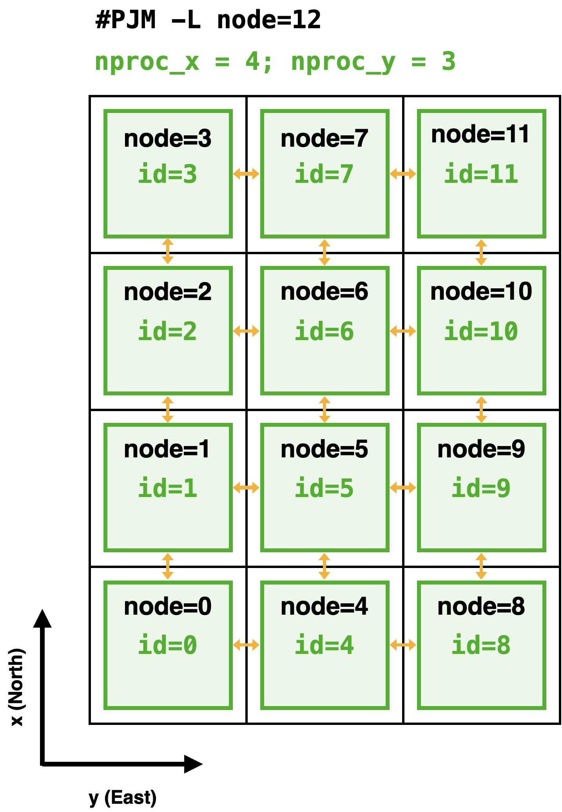
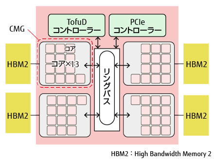
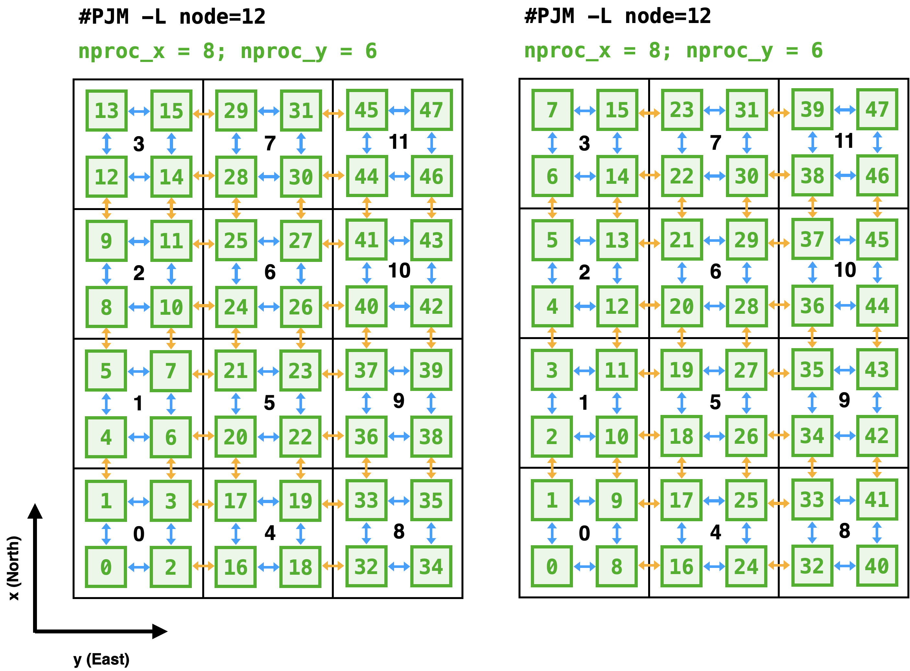
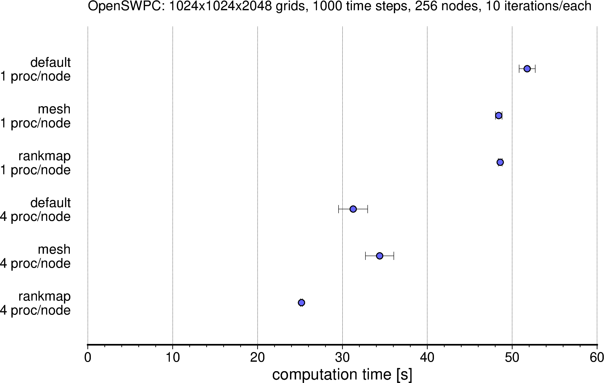

Wisteria/BDEC-01で並列計算を行う際には，

- **1ノードあたりに4プロセス** を配置すること
- Rankmapファイルにより**プロセスの配置**を明示的に指定すること

を強く推奨します．設定はすこしだけ面倒になりますが，これにより計算速度が2倍程度向上します．
計算時間は有限の資源ですので，できるだけ効率的に使うことが重要です．

以下では，その仕組みを簡単に説明し，ジョブスクリプトの設定方法を示します．仕組みには興味がなく実用的な結果だけ知りたい人は，[実践レシピ](#sec-BDEC-rankmap-recipe) に進んでください．

## 前提知識：MPIによる領域分割

OpenSWPCは，ノード間通信にMPIを，ノード内通信にOpenMPを用いたハイブリッド並列計算が実装されています．
そのため，通常は1ノード（1CPU）あたりに1つのMPIプロセスを立ち上げ，CPU内部ではOpenMPによる並列計算を行うことが多いです．

BDECは1ノードあたりに1CPUが配置されていますが，そのCPUは内部で4つのコアグループに分かれており，それらが独立に2次キャッシュや直結したメモリを持っています．コアグループをまたいでも明示的な通信をすることなく（OpenMPで）メモリ内容を参照できますが，実際には効率が悪くなります．

一例として，12ノードを用いた3次元並列計算を行うことを考えましょう．OpenSWPCは3次元空間のうちXY平面を2次元的に分割して，MPIにより各ノードに割り当てます．ここでは，X方向に4ノード，Y方向に3ノードの計12ノードを使うことを考えます．OpenSWPCのパラメタでは

```Fortran
nproc_x = 4
nproc_y = 3
```

に相当します．このとき，XY平面は下図のように分割されます．

{fig-align="center" width=50% #fig-regular-layout}

黒色の正方形が分割された領域です．この場合は1つの領域に1つのMPIプロセス（緑色）が割り当てられています．そのMPIプロセスの内部では，領域内に多数ある空間グリッドの計算をOpenMPにより並列化しています．数値シミュレーションの実行時には，オレンジ色の矢印のように，MPIプロセス間でデータ通信が行われます．

このときのジョブスクリプトは

```bash
#PJM -L    node=12 
#PJM --mpi proc=12         # ノード数と同じ数のプロセスを立ち上げる
#PJM --omp thread=48       # 1プロセスあたり48スレッドを使う
```

となります．1CPU内に48個のコアがありますので，それら1つあたりに1スレッドを立ち上げています．

上記の指定では，12個のノードはX方向を優先して連続的に割り当てられます．
そのため，例えば5番目のノード（MPIプロセス）は，1, 4, 6, 9番目のプロセスと通信します．5番目から見て4番目と6番目は隣接するプロセスですから通信も速いですが，一般的には1番目や9番目との通信は遅くなりがちです．ただし，Wisteria/BDEC-01では，ジョブスクリプトでのノード数指定を

```bash
#PJM -L node=4x3:mesh
```

と分割の形状を指定して `mesh` オプションを付与することで，Y方向への通信も高速になるようなノードが自動的に割り当てられます．

## CPU A64FX の特性と効率的なプロセス配置

Wisteria/BDEC-01で採用されているCPU (Fujitsu A64FX) の内部構造を以下に示します．

{fig-align="center" width=70% #fig-a64fx}

ピンク色の小さな正方形で描かれたCPUコアが52個（ただし4つは計算には使われないアシスタントコアですので，実質48個）ありますから，ノード内のOpenMP並列で48スレッドを使うことができます．実際，[先の例](./BDEC-05-OpenSWPC.md) で例示したジョブスクリプトでは，

```bash
#PJM --omp thread=48
```

という指定によってスレッドを48個立ち上げていました．

しかし，A64FXのCPUコアは，その内部で4つのコアグループに仕切られています．さらに，それぞれのコアグループはHigh Bandwidth Memory (HBM) という高速なメモリに直結しています．
もちろん，CPU内部ではメモリ内のデータは共有されていますから，たとえば図の左上のコアグループから，右下のコアグループに接続されているHBMの情報にもアクセスできます．ただしその場合は，中央のリングバスを経由してアクセスすることとなり，コアグループに直結しているHBMへのアクセスよりもぐっと遅くなります．

逆に言うと，ほとんどいつでもコアグループに直結したHBMだけを使うようにできれば，その計算は大幅に高速化する可能性があるのです．そのために，1CPUの中にプロセスを4つ配置し，コアグループあたり1つのMPIプロセスを立ち上げます．そのうえで，CPU内部でもコアグループ間はMPIによって通信します．MPI通信に用いられるのは，利用する全メモリのうち境界部分のわずかな部分だけです．そのため，MPIプロセスが増えたことによる通信の増大のデメリットよりも，特に高速なメモリだけにアクセスできることのメリットのほうが上回ると期待できるのです．

{fig-align="center" width=95% #fig-four-proc-per-node}

A64FXの特性を生かしたプロセス配置の例を @fig-four-proc-per-node に示します．左右の2通りがありますが，どちらも1ノード（黒四角）の中に4つのプロセス（緑四角）が配置されています．結果として，X方向には8つ，Y方向には6つにXY平面が分割されます．一方でCPU内の48コアを4つのプロセスで分け合うことになりますから，1つのMPIプロセスが使えるコアは12個（12スレッド）になります．これらを踏まえると，ジョブ文の指定は

```bash
#PJM -L    node=4x3:mesh   # 変更なし．ノード数は変わらない
#PJM --mpi proc=48         # ノード数の4倍のプロセスを立ち上げる
#PJM --omp thread=12       # 1プロセスあたり12スレッドを使う
```

また，パラメタファイルの分割数はXY方向それぞれ2倍されて，

```Fortran
nproc_x = 8
nproc_y = 6
```

となります．

### Rankmap ファイル

1CPUあたりに4つのMPIプロセスを立ち上げるだけでも，性能が向上します．しかし，もうすこし効率を上げる余地があります．
それは，MPIプロセスの配置を明示的に指定することです．

単にプロセス数を増やしただけだと，MPIプロセスの配置は左図のようになります．
1つのノード内に連続した4つのプロセスが立ち上がるため，結果としてノード間の通信のプロセス番号が互いに離れてしまいました．

これを防ぐために **rankmap** ファイルを用いて，各プロセスがどのノードに配置されるべきなのかを明示的に指定します．
rankmapファイルの書式は単純で，1行あたり1つの

```
(nodex, nodey)
```

の数字の組み合わせです．その行番号-1のプロセスが，X方向に `nodex` 番目，Y方向に `nodey` 番目のノードに配置されることを意味します．図 @fig-four-proc-per-node の右図のようにするには，

``` {.bash filename="rankmap"}
(0,0) # 0番目のプロセス
(0,0) # 1番目のプロセス
(1,0) # 2番目のプロセス
(1,0) # 3番目のプロセス
(2,0) # 4番目のプロセス
(2,0) # 5番目のプロセス
(3,0) # 6番目のプロセス
(3,0) # 7番目のプロセス
(0,0) # 8番目のプロセス
(0,0) # 9番目のプロセス
  .
  .
  .
```

というふうに指定します．このファイルは以下のPythonスクリプトで機械的に生成できます．

```python
nproc_x = 8 # この数値はOpenSWPCのパラメタファイルと一致させる
nproc_y = 6 # この数値はOpenSWPCのパラメタファイルと一致させる

with open("rankmap", "w") as f:
    for j in range(nproc_y):
        for i in range(nproc_x):
            f.write(f"({i//2},{j//2})\n")

```

なお，上記スクリプトと等価な関数 `bdec_rankmap` が，OpenSWPCに同梱されている `src/tool/swpc.py` モジュールにも含まれています．

こうして作成した `rankmap` ファイルをジョブスクリプトに指定するには，

```bash
#PJM --mpi rank-map-bynode
#PJM --mpi rank-map-hostfile=rankmap
```

とします．

### ベンチマークテスト

このような1ノードあたり4プロセスの指定やrankmap指定により，OpenSWPCがどれだけ高速になるか，ベンチマークテストを実施しました．

<!-- textlint-disable -->

{fig-align="center" width=95% #fig-bdec-rankmap-benchmark}

<!-- textlint-enable -->

その結果を @fig-bdec-rankmap-benchmark に示します．1ノードあたり4プロセスにするだけで計算時間が大幅に短縮し，`rankmap` を追加することでさらに高速化されていることがわかります．図中最上段と最下段とを比較すると，同じ計算結果が半分の時間で得られていることがわかります．

## 実践レシピ {#sec-BDEC-rankmap-recipe}

1. 使用するノード数と，XY方向のノード分割数を決める．以下では `NODE_X`, `NODE_Y` とする．合計利用ノード数は `NODE_X * NODE_Y` となる．
2. OpenSWPCの入力ファイルの `nproc_x`, `nproc_y` を `NODE_X`, `NODE_Y` のそれぞれ2倍にする
3. ジョブスクリプトと同じディレクトリで，下記のPythonスクリプト `gen_rankmap.py` を作成し，`nproc_x`, `nproc_y` の値は手順2のものを設定したうえで実行する．結果として同じディレクトリにファイル `rankmap` が生成される．
4. ジョブスクリプトの設定は以下の `job_example_rankmap.sh` のようにする．

```{.python filename="gen_rankmap.py"}
nproc_x = XX # この数値はOpenSWPCのパラメタファイルと一致させる
nproc_y = YY # この数値はOpenSWPCのパラメタファイルと一致させる

with open("rankmap", "w") as f:
    for j in range(nproc_y):
        for i in range(nproc_x):
            f.write(f"({i//2},{j//2})\n")

```

```{.bash filename="job_example_rankmap.sh"}
#!/bin/bash

#PJM -L    rscgrp=regular-o
#PJM -L    node=${NODE_X}x${NODE_Y}:mesh  # <-- 設定値を代入
#PJM --mpi proc=${NODE_X}*${NODE_Y}       # <-- 全ノード数を代入
#PJM --mpi rank-map-bynode
#PJM --mpi rank-map-hostfile=rankmap
#PJM --omp thread=12
#PJM -L    elapse=01:00:00
#PJM -g    ${GROUP}
#PJM -N    OpenSWPC
#PJM -o    OpenSWPC.out
#PJM -j 

# ---------- 
module load fj fjmpi netcdf hdf5 netcdf-fortran

mpiexec ./bin/swpc_3d.x -i in/input.inf
```
