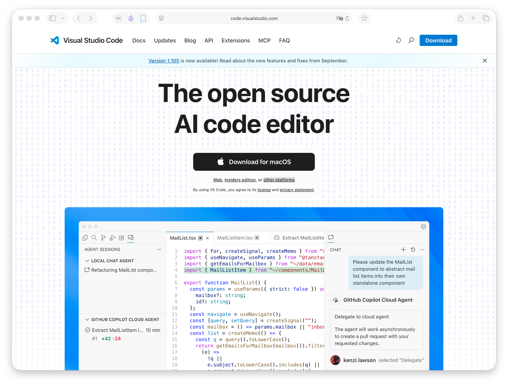

## VSCodeのインストール

[Visual Studio Code（VSCode）](https://code.visualstudio.com/)は，Microsoft が提供する軽量かつ高機能なエディタです．まず，公式サイト（[https://code.visualstudio.com/](https://code.visualstudio.com/)）から，自分の環境に合ったインストーラをダウンロードしてインストールします．Windows, macOSそしてLinuxのdebおよびrpmパッケージがそれぞれ提供されています．普通は公式サイトのトップページに，自分の環境のインストーラへのリンクが掲載されています．もしそうでなかったり，他の環境のインストーラが必要でしたら，[other platforms](https://code.visualstudio.com/Download) のリンクから所望のインストーラを探してください．



インストール後，アプリケーション一覧から「Visual Studio Code」を起動できれば準備完了です．

::: callout-note
スクリーンショットは2025年10月時点のもので，アクセス時点での画面とは異なる場合があります．また，以下の操作画面はmacOS Tahoe 26.0.1 で撮影したものです．バージョンや環境により若干の差異があるかもしれません．
:::

## 日本語化

デフォルトのVSCodeの操作画面およびメニューは英語です．このままでも不都合はありませんが，拡張機能 **Japanese Language Pack for Visual Studio Code** を導入することで，日本語化できます．

サイドバーの拡張機能アイコン（4つの四角）をクリックします．
検索窓に “Japanese Language Pack” と入力し，Microsoft 公式のパッケージをインストールします．
インストール後，再起動するとメニューが日本語表示になります．

## コマンドライン導入（macOS）

macOS利用の方は，VSCode をコマンドラインから起動できるようにしておくと便利です．
VSCode を開いた状態で <kbd>Command</kbd> + <kbd>Shift</kbd> + <kbd>p</kbd> を押し，"Shell Command" と入力すると， **Shell Command: Install 'code' command in PATH** という選択肢が現れますので，それを実行します．

これにより，ターミナルから次のように起動できるようになります：

```bash
code .
```

このコマンドは，現在のディレクトリ（`.`）をVSCodeで開くものです．

## 最低限の拡張機能の導入

VSCodeは拡張機能（プラグイン）がたくさん開発されており，それらを導入することでより便利に使えます．左側列の拡張機能アイコン（4つの四角）から，以下の拡張機能を検索してインストールしておくことを推奨します．

- Python
- Jupyter
- Remote - SSH
- Modern Fortran

::: callout-warning
VSCodeの拡張機能はだれでも公開できるため，同名の拡張機能が複数存在することがあります．検索したパッケージを選択すると表示されるパッケージ内容詳細画面に**作成者**が明記されていますので，確認したうえでインストールするようにしましょう．上記の推奨パッケージの作成者は，Python, Jupyter, Remote - SSHがMicrosoft，Modern Fortranはfortran-lang.org です．
:::

## VSCode画面解説

VSCodeは**テキストエディタ**ですので，プログラムのソースコードや文章などのテキストファイルの編集ができます．しかし，それ以上に**統合環境**としての機能が充実しているのが特徴です．以下の画面はPythonファイル（`.py`），Fortranファイル（`.f90`），Jupyter Notebookを同時に開いた状態です．


::: callout-tip
上記スクリーンショットでは，筆者の環境で上述したもの以外の拡張機能が導入されているため，ウインドウ左側列に様々なアイコンが表示されていますが，とりあえず気にする必要はありません．
:::

VSCodeは個々のファイルではなくディレクトリ（フォルダ）を開くことができます．その場合には左列のメニュー（エクスプローラ）に開いているディレクトリ名（この場合は `TEST`）とその中のファイル一覧が表示され，ここから開くファイルを選ぶことができます．画面右上の広い領域を占めるのがエディタ部分ですが，ここでは**タブ**によって3つのファイルを同時に開いています．FortranとPythonの拡張機能を導入したことによって，それぞれのソースコードについてキーワードが自動的に強調されています．また，Jupyter Notebook (`.ipynb`) ファイルも開くことができ，Pythonの環境が適切にインストールされていれば，その場で実行もできます．VSCodeが対応するファイル種類の範囲は広く，`jpg`や`png`, `bmp`といった標準的な画像ファイルであれば，VSCode内で表示できます．PDFファイルや動画ファイルについては，適切な拡張機能を導入すれば表示できます．さらに，メニューから "ターミナル" → "新しいターミナル" を選ぶと，画面下部にコマンドライン入力のためのターミナルを表示できます．

つまり，プログラムを編集してコマンドラインから実行することや，Jupyter NotebookでPythonの対話実行により可視化をしたり，あるいはまとめて可視化した結果の画像ファイルを閲覧したり，といった，Fortran/Pythonプログラミング環境を活用した研究に関わる活動のほとんどがVSCode上で完結させられるのです．

## Word wrap設定

メニュー Code→基本設定→設定 で設定画面が現れます．設定内容は膨大ですが，検索窓から Wrap を入力し，Editor: Word Wrap というメニューの下の選択肢を on にします． これで（プログラミングなどで）長い行を書いたときに，エディタの右端で自動的に折り返されるようになります．

## SSHによるリモート環境への接続

VSCodeにRemote - SSH拡張機能を導入していれば，VSCodeからSSHでリモートサーバに接続し，リモートサーバ上のディレクトリをあたかもローカルのディレクトリと同じように開き，操作できます．

VSCodeウインドウの左列のアイコンのうち，ディスプレイのマーク右下に丸印中に `><` のようなマークがSSH接続のためのアイコンです．押すと，下図のように既知のサーバ一覧が出てきます．


このサーバ一覧は `~/.ssh/config` に記載されているエントリから読み込まれています．事前にスパコンへの接続の設定を済ませてあれば，その登録名が表示されます．

あらかじめ登録されているホストに接続するには，そのホスト名にマウスをオーバーレイ（ポインタをその上に持っていくこと）すると，ホスト名右側に `→` と 四角いマークの左上に `+` の描かれたアイコンが表示されます．前者は現在のウインドウで，後者は新しいウインドウを立ち上げて，それぞれそのホストに接続するマークです．接続を試みると，必要に応じてパスワードが聞かれます．

::: callout-tip
過去に接続したことがあるホストでは，そのホストで開いたディレクトリ名が一覧で表示されますので，そこからリモートの特定のフォルダをいきなり開くこともできます．
:::

登録済みではないサーバにあらたに接続する場合には，`SSH` と書かれた部分にマウスをオーバーレイすると，右側に`+`マークが現れます．そのボタンを押すと，画面上部に接続先ホスト名（あるいはIP番号）を入力する画面が現れます．


あとはパスワードを入力すれば，接続完了です．以下のスクリーンショットは一例として東京大学地震研究所のEIC計算機システムのホームディレクトリに接続した直後の様子です．


一見ローカルと変わらないようですが，エクスプローラで表示されているファイルとディレクトリはリモートサーバのもの，ターミナルもリモートサーバ上のbashが実行されています．リモートに接続している状態では，画面左下に接続先ホストが表示されますので，それで区別できます．

## リモートサーバにおけるVSCode拡張の導入

ローカルPCで導入したVSCodeの拡張機能は，リモートサーバでは動作しません．リモートサーバに接続した状態で，あらためて以下の拡張機能を導入しておきましょう．

- Python
- Jupyter
- Modern Fortran
